## 说明文档 [documentation]


```c
source 'https://github.com/idoosmart/IDOSmartSpec.git'
platform :ios, '13.0'
target 'your_target_name' do
   pod 'IDOBluetooth'
   pod 'IDOBlueProtocol'
   pod 'IDOBlueUpdate'
end
```


* [中文](https://idoosmart.github.io/IDOGitBook/zh/)      

* [English](https://idoosmart.github.io/IDOGitBook/en/)

2024-07-24 
update log: add Siche ota and run plan

IDOBluetooth  3.13.29
IDOBlueProtocol 3.40.45
IDOBlueUpdate 3.6.23


### Siche ota demo 

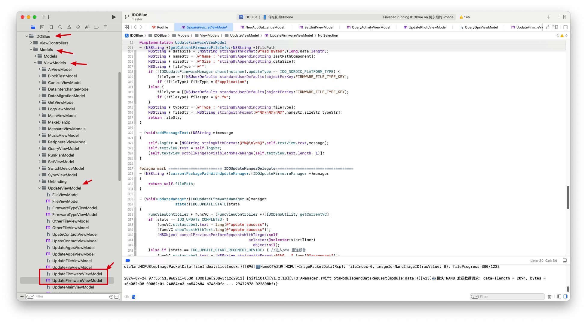

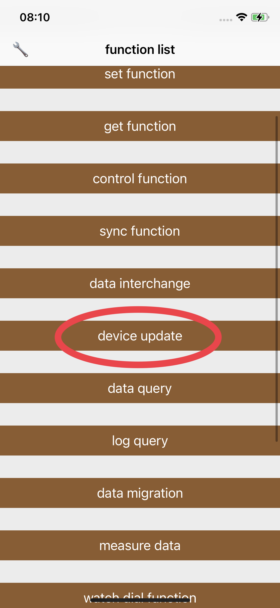

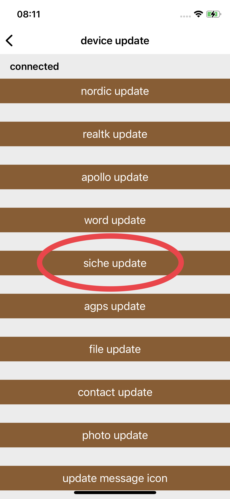

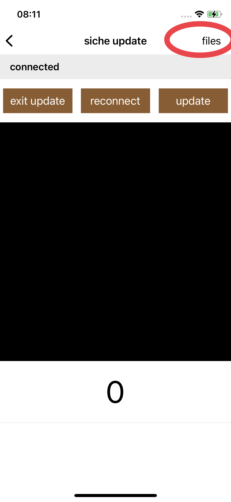

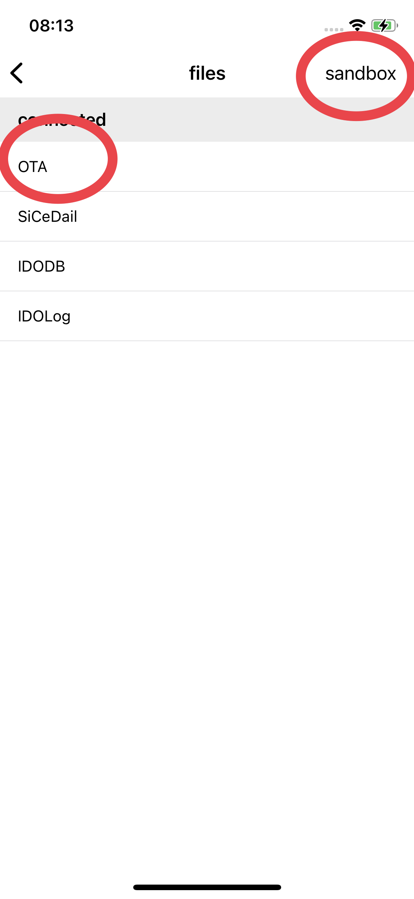

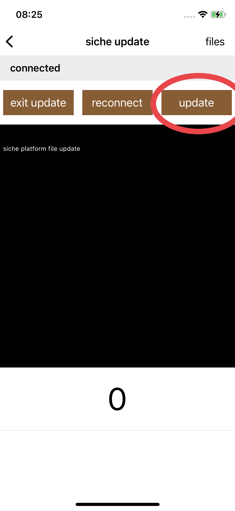


- Decompress the upgrade file and import the directory to the application sandbox

- ```objective-c
   [IDOUpdateFirmwareManager shareInstance].updateType = IDO_SIFLI_PLATFORM_TYPE;
   [IDOUpdateFirmwareManager shareInstance].deviceUUID = IDO_BLUE_ENGINE.peripheralEngine.uuidStr;
   [IDOUpdateFirmwareManager startUpdate];
   
   #pragma mark ======================== IDOUpdateMangerDelegate===================================
  - (NSString *)currentPackagePathWithUpdateManager:(IDOUpdateFirmwareManager *)manager
  {
      return self.filePath;
  }
  
  - (void)updateManager:(IDOUpdateFirmwareManager *)manager
                  state:(IDO_UPDATE_STATE)state
  {
      FuncViewController * funcVC = (FuncViewController *)[IDODemoUtility getCurrentVC];
      if (state == IDO_UPDATE_COMPLETED) {
          funcVC.statusLabel.text = lang(@"update success");
          [funcVC showToastWithText:lang(@"update success")];
          [NSObject cancelPreviousPerformRequestsWithTarget:self
                                                   selector:@selector(startTimer)
                                                     object:nil];
      }else if (state == IDO_UPDATE_START_RECONECT_DEVICE) { //进入ota 重连设备
          funcVC.statusLabel.text = [NSString stringWithFormat:@"%@...",lang(@"reconnect")];
      }else if (state != IDO_UPDATE_START_INIT
                && state != IDO_UPDATE_COMPLETED){
          funcVC.statusLabel.text = lang(@"update...");
      }
  }
  
  - (void)updateManager:(IDOUpdateFirmwareManager *)manager updateError:(NSError *)error
  {
      if (error.code == 3) {
          [IDOFoundationCommand getFuncTableCommand:nil];
      }
      FuncViewController * funcVC = (FuncViewController *)[IDODemoUtility getCurrentVC];
      funcVC.statusLabel.text = lang(@"update failed");
      [funcVC showToastWithText:lang(@"update failed")];
      NSString * errorStr = [NSString stringWithFormat:@"%@\n",error.domain];
      [self addMessageText:errorStr];
      [NSObject cancelPreviousPerformRequestsWithTarget:self selector:@selector(startTimer) object:nil];
  }
  
  - (void)updateManager:(IDOUpdateFirmwareManager *)manager
               progress:(float)progress
                message:(NSString *)message
  {
      if (progress > 0) {
          FuncViewController * funcVC = (FuncViewController *)[IDODemoUtility getCurrentVC];
          [funcVC showUpdateProgress:progress];
      }else {
          [self addMessageText:message?:@""];
      }
  }
  
  ```

  

### Run plan

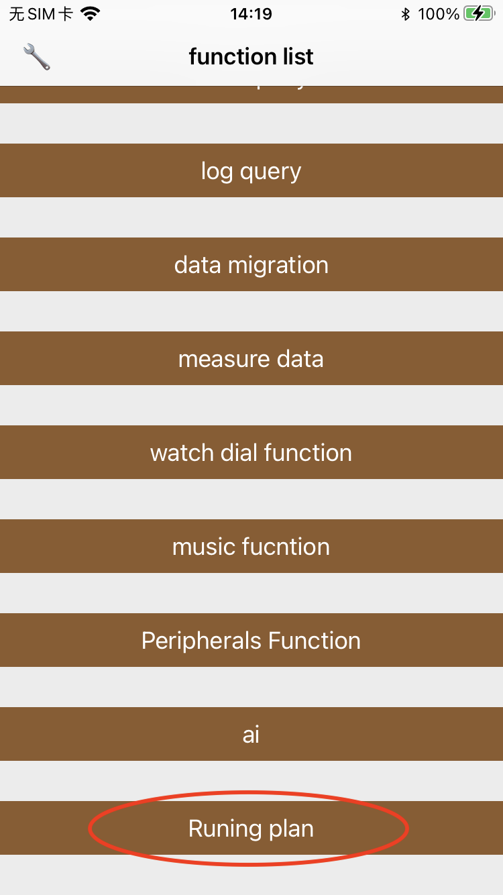

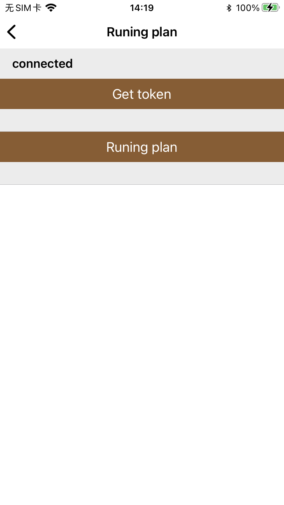

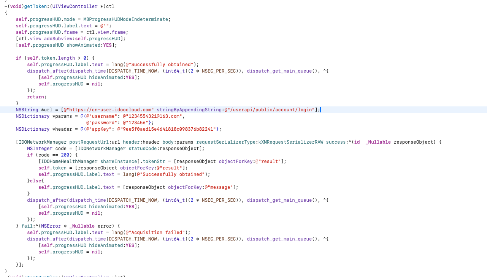

- Login account to obtain Token

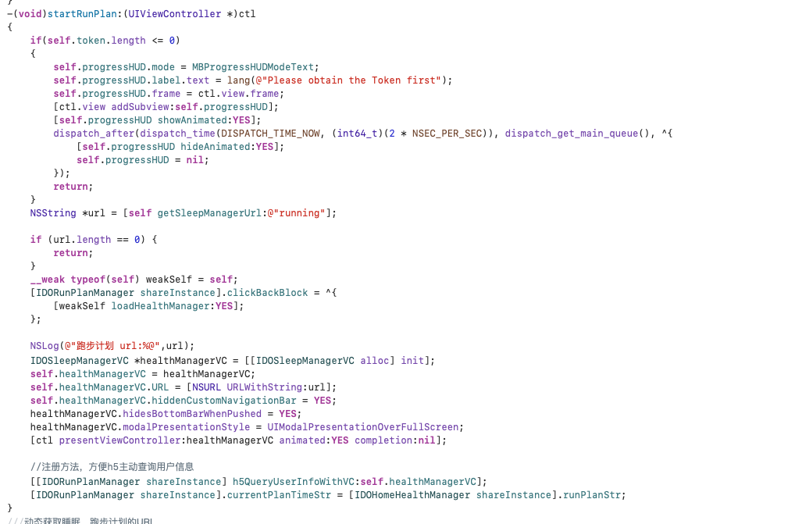

- Start Runing plan

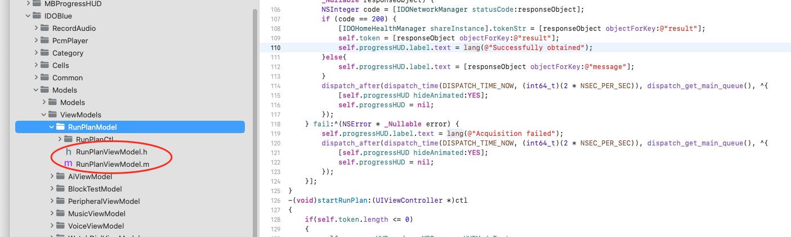

- Upload user and device information

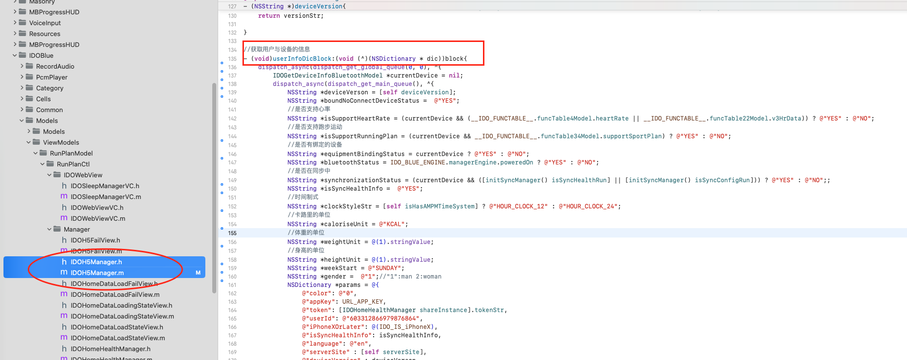

- Running plan management category (issuing plans, querying plans, synchronizing plans, ending plans

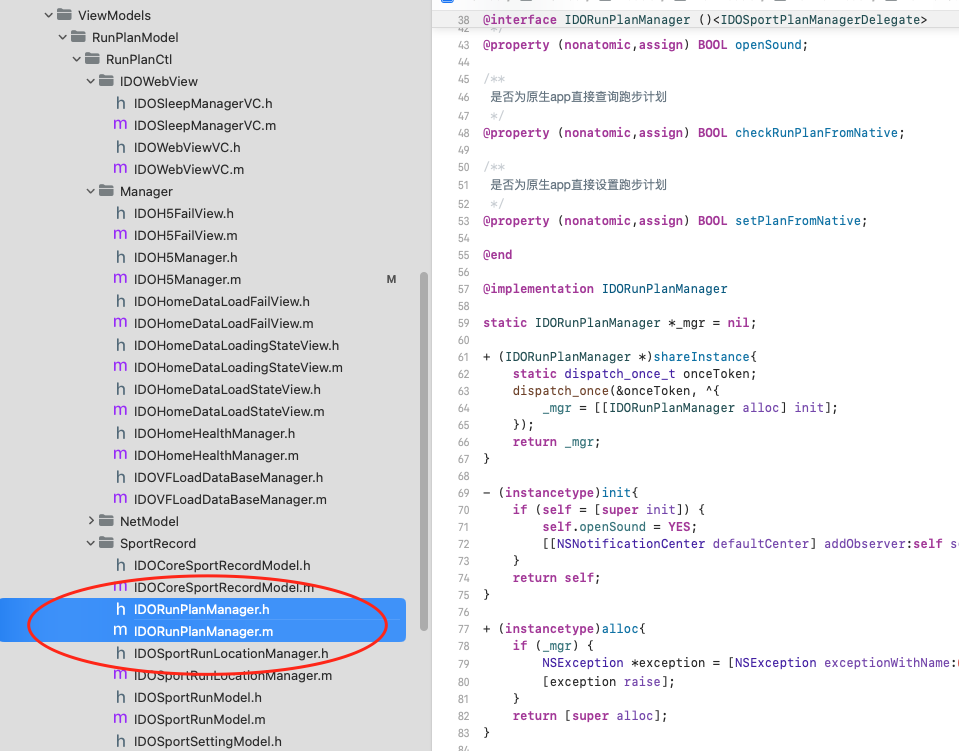

- Training management in running plans (real-time interaction with devices, H5 data, pause exercise, end exercise

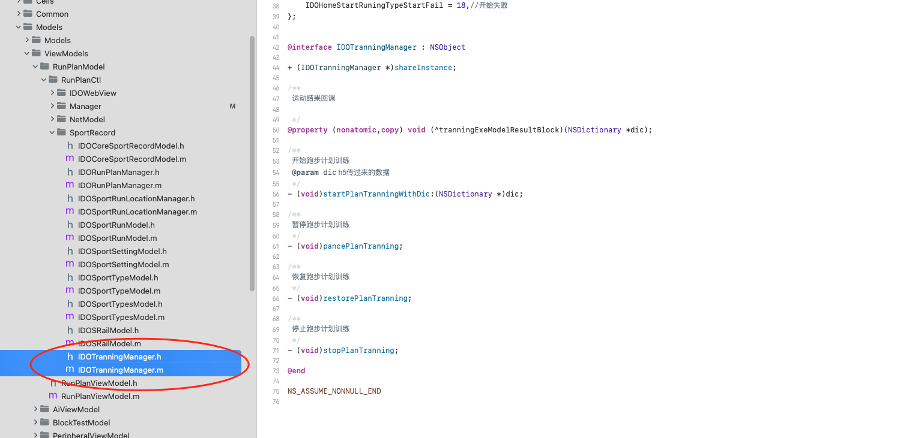

- Server interface queries running plan details

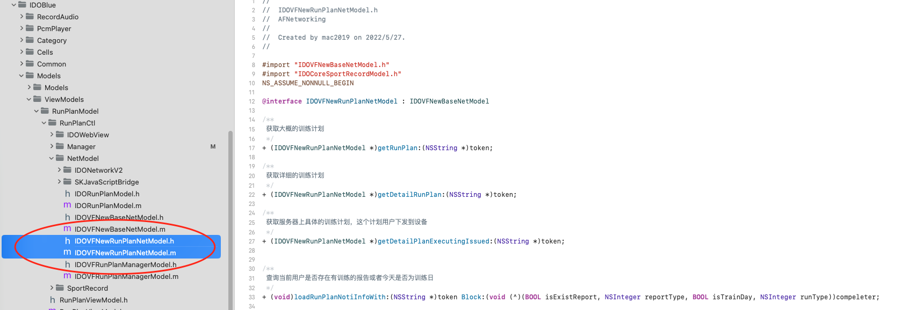